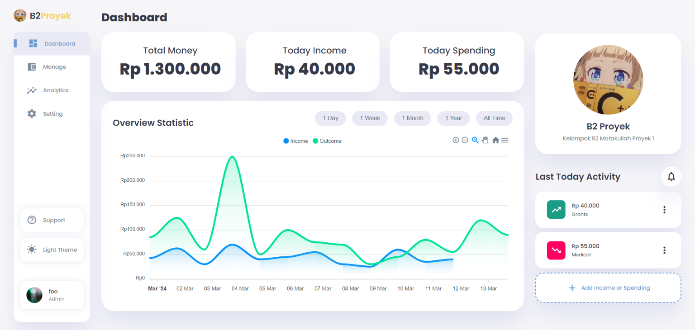

<!-- PROJECT LOGO -->

 

  

<h3 align="center">Money Tracking App</h3>

  

    simple yet, backend-less money tracking app developed by <a href="#contributor">B2 - D4 TI</a>
     
    <a href="https://github.com/muhammadfajri-tif/b2-money-tracking#"><strong>Explore the docs »</strong></a>
     
     
    <a href="https://muhammadfajri-tif.github.io/b2-money-tracking">View Demo</a>
    ·
    <a href="https://github.com/muhammadfajri-tif/b2-money-tracking/issues">Report Bug</a>
    ·
    <a href="https://github.com/muhammadfajri-tif/b2-money-tracking/issues">Request Feature</a>
  

<!-- TABLE OF CONTENTS -->

  
Table of Contents

  <ol>
    <li>
        <a href="#about-the-project">About The Project</a>
        <ul>
            <li><a href="#showcase">Showcase</a></li>
            <li><a href="#tech-stack">Tech Stack</a></li>
        </ul>
    </li>
    <li>
        <a href="#features">Features</a>
        <ul>
            <li><a href="#face-recognition">Face Recognition</a></li>
            <li><a href="#data-visualization">Data Visualization</a></li>
            <li><a href="#analytics">Analytics</a></li>
            <li><a href="#manage">Manage</a></li>
            <li><a href="#backuprestore">Backup/Restore</a></li>
        </ul>
    </li>
    <li><a href="#contributor">Contributor</a></li>
  </ol>

<!-- ABOUT THE PROJECT -->
## About The Project

Money Tracking App by [by B2](#contributor) boasts an innovative approach to simplicity and user experience. With its emphasis on facial recognition for accessing dashboard, users can manage their finances with confidence. Additionally, the app offers robust data visualization tools, empowering users to gain valuable insights into their financial habits. Its analytics feature allows for easy export of data to CSV or JSON formats, ensuring seamless integration with other applications. Users can efficiently manage their transactions, with options to delete, update, and add new entries effortlessly. Moreover, the app provides a reliable backup and restore feature, allowing users to safeguard their data and restore it whenever needed, providing peace of mind in the digital age. Learn more about the complete features in [features section](#features).

### Showcase

  
<strong>Landing Page</strong>

    <ul>
        <li>
            
        </li>
    </ul>

  
<strong>Face Recognition</strong>

    <ul>
        <li>
            
        </li>
    </ul>

  
<strong>Dashboard</strong>

    <ul>
        <li>
            
        </li>
    </ul>

  
<strong>Data Analytics & Visualization</strong>

    <ul>
        <li>
            
        </li>
    </ul>

  
<strong>Manage Transaction</strong>

    <ul>
        <li>
            
        </li>
    </ul>

<!-- Tech Stack -->
### Tech Stack

**Markup/Programming Languages**

**Version Control System & Code Repository + Colaboration**

**Supported File Format for Export/Import Data**

<!-- [![CSV]](./docs/csv-icon.png =48x48)(https://en.wikipedia.org/wiki/Comma-separated_values) -->
<!-- [(https://www.json.org/json-en.html) -->

**Storage System**

<!-- (https://developer.mozilla.org/en-US/docs/Web/API/Window/localStorage) -->

**Additional Tools**

<!-- [![Draw IO]](./docs/drawio.png =42x48)(https://www.drawio.com/) -->

(<a href="#readme-top">back to top</a>)

 <!-- Features Section -->
## Features

### Face Recognition

The face recognition featurerequiring users to authenticate themselves using facial recognition technology before accessing the dashboard application. 

### Data Visualization

The data visualization feature provides users with graphical representations of their financial data, such as income, and spending. User can choose to view their data on a daily, weekly, quarterly, or yearly basis, providing them with a comprehensive overview of their financial habits. This helps users to easily understand their financial situation at a glance, identify trends, and make informed decisions about their finances.

### Analytics

The analytics feature allows users to analyze their financial data in more detail by providing tools for generating custom reports and insights. Users can export their data to CSV or JSON format, enabling them to perform further analysis using external tools or software.

### Manage

The manage feature allows users to easily add, update, and delete their income and spending transactions. Users can categorize their transactions, and view their transaction history, providing them with greater control over their finances.

### Backup/Restore

The backup and restore feature allows users to securely save their financial data and restore it at a later time if needed. Users can export their transactions and account information to a CSV or JSON file, ensuring that their data is safely backed up. In case of accidental deletion or loss of data, users can easily restore their information from the backup file, ensuring continuity of their financial records.

(<a href="#readme-top">back to top</a>)

## Contributor

- [231524044] **Fathan Khairun Normawijaya** *developing landing page + documentation*
- [231524045] **Hanif Ahmad Rizqullah** *developing dashboard*
- [231524053] **Muhammad Fajri** *developing export/import account + manage transaction features*
- [231524054] **Muhammad Gianluigi Julian** *developing landing page*
- [231524064] **Yahya Alfon Sinaga** *developing face recognition, data visualization + analytics features*

(<a href="#readme-top">back to top</a>)

